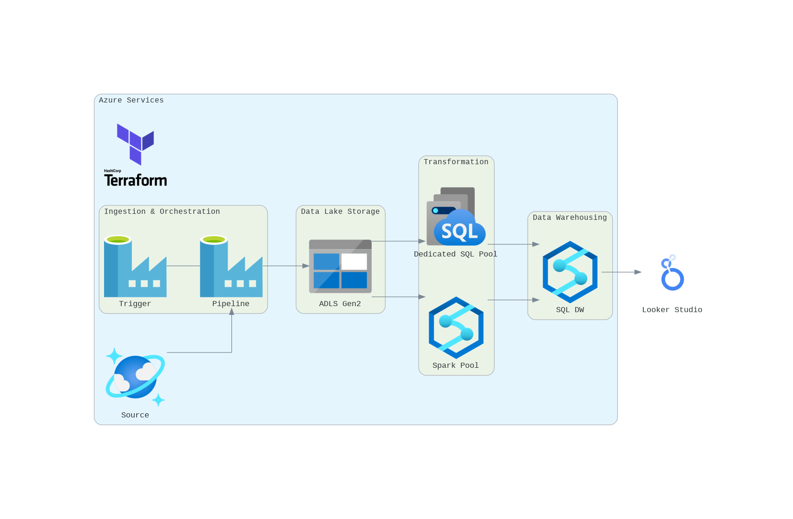
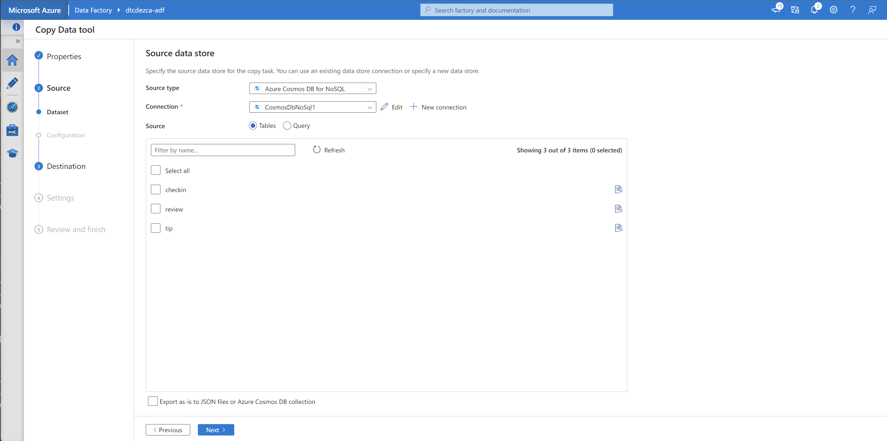
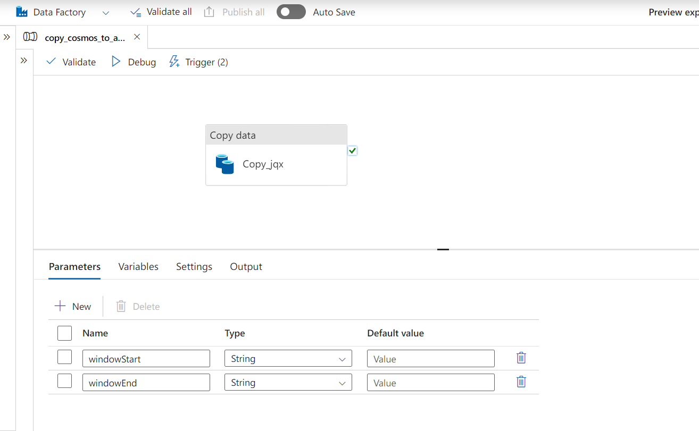
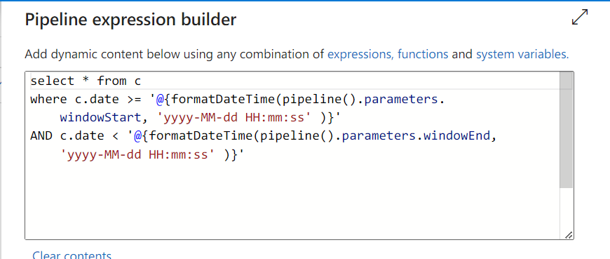
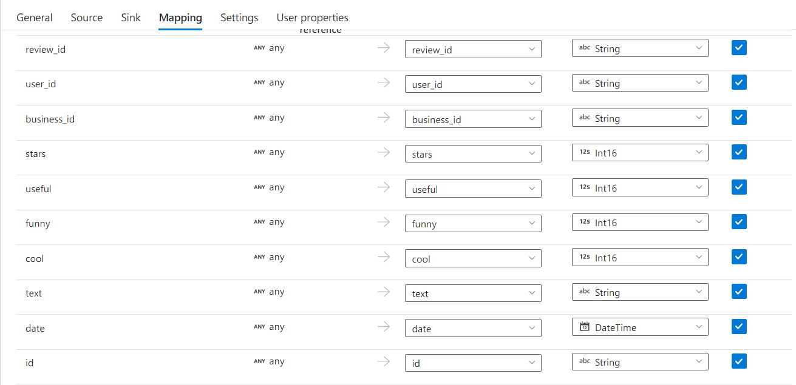
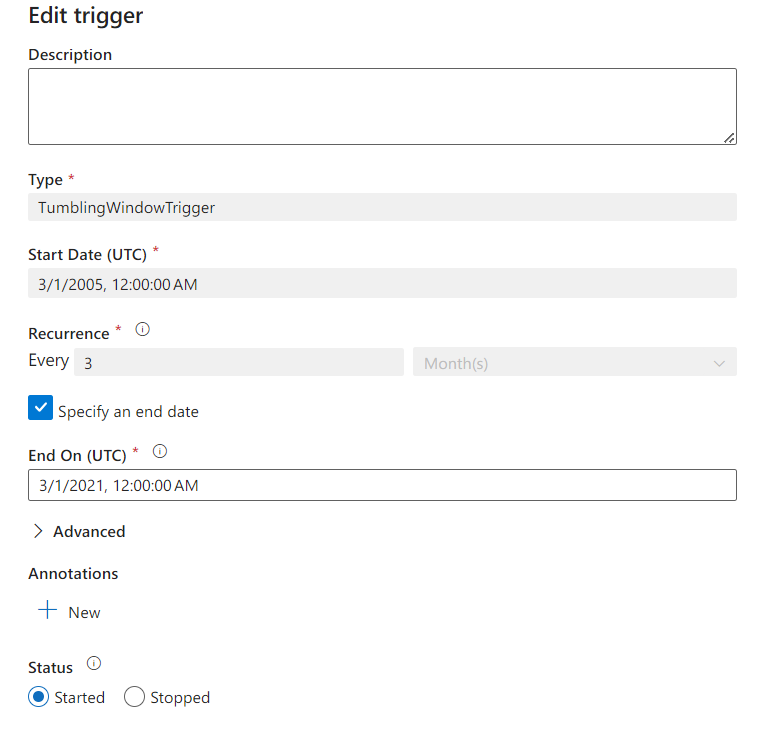
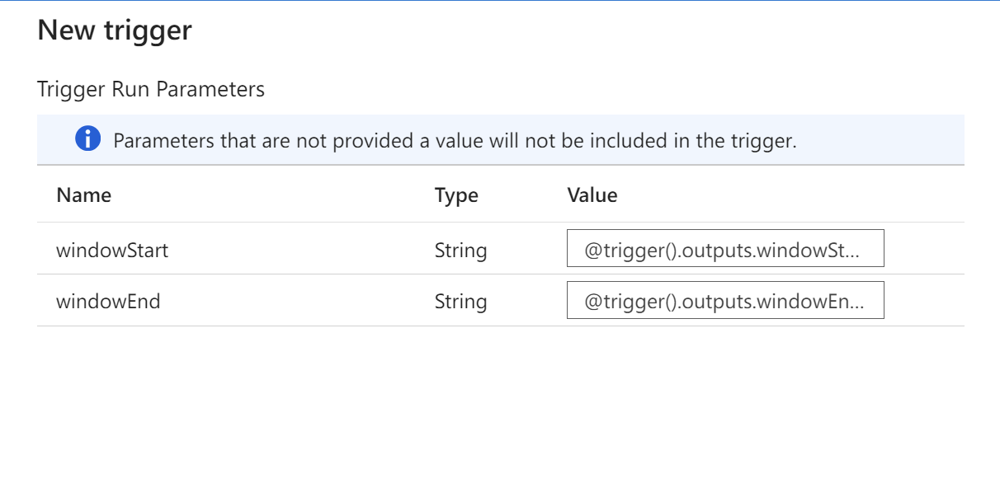
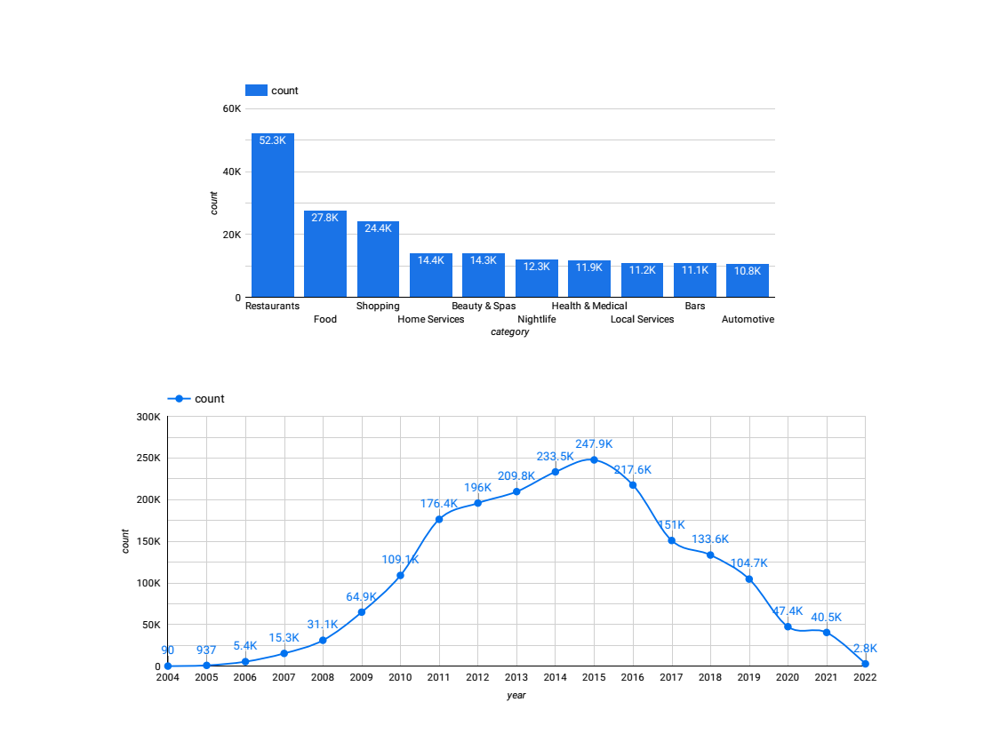

# An End-to-end Data Engineering project on Yelp Dataset

## Problem Statement

In this project, we aim to leverage the Yelp dataset to gain insights into consumer preferences and business performance. Our objectives include:

1. Business Profiling: analysis of business attributes, such as category, location, and hours of operation.
2. Trend Analysis of the Yelp platform.

## Introduction to the Dataset

The dataset is taken from the official Yelp Open Dataset website. It is a subset of Yelp's businesses, reviews, and user data for personal, educational, and academic purposes. It is available in JSON files.

For a detailed description of the schema, please refer to [Dataset.md](Dataset.md).

## Tech Stack



| Component       | Technology               | Explanation                                                                                                                                                                                                                                                                     |
| --------------- | ------------------------ | ------------------------------------------------------------------------------------------------------------------------------------------------------------------------------------------------------------------------------------------------------------------------------- |
| Cloud           | Microsoft Azure          | Utilizes Microsoft Azure as the primary platform for cloud computing and data technologies.                                                                                                                                                                                     |
| IaC tool        | Terraform                | Deploys Azure Resource Manager and various resources through Terraform.                                                                                                                                                                                                         |
| Data Ingestion  | Azure Data Factory       | Employs Azure Data Factory for extracting data from the Cosmo DB source system, batch loading it to ADLS as Parquet files. Uses tumbling window triggers for automatic historic data backfill (from 2005 to 2019) to the data lake.                                             |
| Data Warehouse  | Azure Synapse Analytics  | Leverages Azure Synapse Analytics' dedicated SQL pool (formerly SQL DW) to partition and load data from ADLS.                                                                                                                                                                   |
| Transformations | Azure Synapse Spark Pool | Uses Azure Synapse Spark Pool with PySpark for data transformations, preferring it over Azure Databricks for better integration with BI tools. See [this Post](https://learn.microsoft.com/en-us/answers/questions/1276055/when-to-use-synapse-spark-pool-vs-azure-databricks). |
| Dashboard       | Google Looker Studio     | Connects to the dedicated SQL pool tables for data visualization in Google Looker Studio. Power BI is not used due to licensing constraints of the organization's account.                                                                                                      |

## Prerequisites

Before you begin, ensure you have the following:

- **Operating System**: Compatible with Linux OS. Tested on WSL2 in Windows.
- **Required Tools**: Azure CLI, Python, Terraform, and Git.
- **Azure Subscription**: Necessary for deploying resources.
- **Azure Service Principal**: Required for authenticating with Azure from
  Terraform. [Create a service principal](https://registry.terraform.io/providers/hashicorp/azurerm/latest/docs/guides/service_principal_client_secret).

## Environment Setup Instructions

### Step 1: Install Azure CLI on Linux

```shell
curl -sL https://aka.ms/InstallAzureCLIDeb | sudo bash
```

### Step 2: Get Terraform

```shell
wget -O- https://apt.releases.hashicorp.com/gpg | sudo gpg --dearmor -o /usr/share/keyrings/hashicorp-archive-keyring.gpg
echo "deb [signed-by=/usr/share/keyrings/hashicorp-archive-keyring.gpg] https://apt.releases.hashicorp.com $(lsb_release -cs) main" | sudo tee /etc/apt/sources.list.d/hashicorp.list
sudo apt update && sudo apt install terraform
```

### Step 3: Login with Azure CLI and Retrieve Credentials

```shell
az account list
```

### Step 4: Create a Service Principal

```shell
az ad sp create-for-rbac --role="Owner" --scopes="/subscriptions/aaaaaaaa-bbbb-cccc-dddd-eeeeeeeeeeee"
```

### Step 5: Prepare Configuration Files

You will get the credentials from the output of step 4.

Fill `credentials-example.json` with values obtained from the above steps, then rename it to `credentials.json`.
Add a key-value pair for your subscription ID obtained from the above steps in `credentials.json`.

## Project Setup

### Acquire Dataset

The dataset is available at [Yelp's official website](https://www.yelp.com/dataset/download) or [Kaggle.com](https://www.kaggle.com/datasets/yelp-dataset/yelp-dataset). Store all the json files under `./cosmos-db/datasets` directory.

### Terraform Environment Setup

1. Load environment variables (for Terraform and azure resources):
   At root directory, execute this command:

   ```shell
   eval $(python3 set_credentials.py)
   ```

   Execute this command to check if the env var are present:

   ```
   printenv | grep ARM_
   ```

   For more details on creating and configuring a service principal in Terraform, refer
   to [Authenticating using a Service Principal with a Client Secret](https://registry.terraform.io/providers/hashicorp/azurerm/latest/docs/guides/service_principal_client_secret#configuring-the-service-principal-in-terraform).

### Azure Resources Setup

1.  Initialize and apply the Terraform plan:

    ```shell
    terraform plan -out main.tfplan
    terraform apply main.tfplan
    ```

    Upon completion, verify the creation of resources in the `dtcdezca-rg` resource group
    on [Azure Portal](https://portal.azure.com/).

### Import JSON Files into Cosmos DB

1. Authenticate Cosmos DB Client:

   Retrieve the `documentEndpoint`:

   ```shell
   export ACCOUNT_URI=$(az cosmosdb show --subscription $ARM_SUBSCRIPTION_ID --name $ACCT_NAME --resource-group $RES_GROUP --query documentEndpoint --output tsv)
   ```

   Retrieve the `primaryMasterKey`:

   ```shell
   export ACCOUNT_KEY=$(az cosmosdb keys list --name $ACCT_NAME --subscription $ARM_SUBSCRIPTION_ID --resource-group $RES_GROUP --query primaryMasterKey --output tsv)
   ```

2. Run the Python script to load the data into Cosmos DB.

   **Caution: This step would take a very long time since we are using a free tier for cosmos db with constrained throughput. It is suggested loading a portion of data for testing purpose.(Enter the range of data to be inserted.)**

   Under `./cosmos-db` directory, execute this command:

   ```shell
   python3 import_json_into_db.py $ACCOUNT_URI $ACCOUNT_KEY review 0 100000
   ```

## Data Ingestion (using Azure Data Factory)

### Explanation

In this project, `review`, `tip`, and `checkin` are considered as transactional data. On the other hand, `business` and `user` are dimensional data (though in reality these data also grow very frequency).

So transactional data are originally stored in Cosmos DB. By ELT framework, the data will be extracted from source system to data lake using Azure Data Factory. For this project and for learning purpose, only `review` json data is imported using ADF, while `tip` and `checkin` will be transformed and partitioned using Spark later.

### Copy Data Tool

At Home Page, click "Ingest" to create a copy data tool. Use "Cosmos DB" as the source and "ADLS Gen2" as the sink.



### Pipeline



### Activity

Source query:


Sink:
The dataset properties are:

- cw*fileName: `data\*@{formatDateTime(pipeline().parameters.windowStart,'yyyy')}*@{formatDateTime(pipeline().parameters.windowStart,'MM')}\_@{formatDateTime(pipeline().parameters.windowStart,'dd')}.parquet`

- cw_folderPath: `@{formatDateTime(pipeline().parameters.windowStart,'yyyy')}/@{formatDateTime(pipeline().parameters.windowStart,'MM')}`

to do partitioning on the ingested data.

Mapping:



### Trigger

Add new trigger to the pipeline, with tumbling window.



```
StartDate: 3/1/2005, 00:00:00 AM
End On: 3/1/2021, 00:00:00 AM
```

For the parameters, give these:


```
windowStart: @trigger().outputs.windowStartTime
windowEnd: @trigger().outputs.windowEndTime
```

## Data Warehouse (using Azure Synapse Analytics Dedicated SQL Pool)

### Setup

- Check "Allow Azure services and resources to access this workspace" option under "Security -> Networking" tab
- Add current client IP.

### Approach

1. Use PolyBase to create external tables in Synapse Analytics that reference the partitioned `review` data in ADLS. They are in parquet format.

   Go to `./asa` directory and execute the two scripts (after put the credentials).

2. I defined the schema of the JSON files and create external tables that map to this schema. This way, I can query the JSON data using T-SQL as if it were in a regular table. This is a good option if JSON files are large and moving or copying the data is not preferred.

## Data Transformation (using Azure Synapse Analytics Spark Pool)

### Setup

`tip` and `checkin` data should be manually uploaded to ADLS using UI.

Test the connection of Spark pool to ADLS2, if connection failed, please add `Storage Blob Data Owner` role to `dtcdezca-asw`.

Go to "Configure session", check "Run as managed identity".

### Transformation Tasks

1. Cleaned the `tip` data.
2. Partitioned `tip` and `checkin` data and wrote the data to datawarehouse.

Refer to [sparkpool.ipynb](./asa/sparkpool.ipynb).

## Dashboard


[Dashboard link](https://lookerstudio.google.com/reporting/45689720-798b-41f5-a3b1-13cee23003ae)

Tile 1: A bar chart showing the frequency of different business categories (e.g., Restaurants, Shopping, Beauty & Spas).

Title 2: Number of new users in each year.
